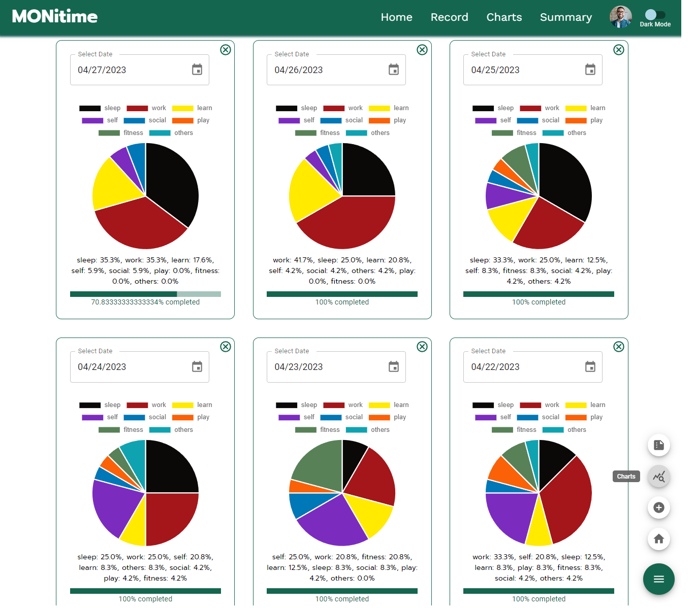

<!-- Improved compatibility of back to top link: See: https://github.com/othneildrew/Best-README-Template/pull/73 -->

<a name="readme-top"></a>

<!-- PROJECT LOGO -->
<br />
<div align="center">

<h1 align="center">MONitime</h1>

  <p align="center">
    A time tracking web app to help you track your time and optimize your life.
    <br />
    <a href="#"><strong>Explore the repo</strong></a>
    <br />
    <br />
    <a href="#">View Demo</a>
  </p>
</div>

<!-- ABOUT THE PROJECT -->


## About The Project

MONitime is a time monitoring app that allows users to track their daily
activities and the time they spend on them. By logging, tracking, analyzing, and
summarizing the data, the app helps users become more productive and efficient
by identifying areas where they need to adjust their time allocation according
to their personal goals and targets.

### Built With

- [![Modern JS][Modern-JS-badge]][Modern-JS-url]
- [![React.js][React-js-badge]][React-js-url]
- [![MaterialUI][Material-UI-badge]][Material-UI-url]
- [![Node.js][Node-js-badge]][Node-js-url]
- [![Express.js][Express-js-badge]][Express-js-url]
- [![MongoDB][MongoDB-badge]][MongoDB-url]

<!-- GETTING STARTED -->

## Getting Started

To get a local copy up and running follow these simple example steps.

### Prerequisites

Before you begin, make sure you have the following installed on your computer:

Node.js: You can download it from the [official website](https://nodejs.org/).
React.js: You can install it by running `npm install -g create-react-app` in
your terminal. MongoDB: You can download and install it from the official
website.

### Installation

1. Clone the repository to your local machine
   ```sh
   git clone ssdfsfsfsfsdf
   ```
2. Install NPM packages in both the client and server folders
   ```sh
   cd client
   npm install
   cd ../server
   npm install
   ```
3. Start the server by running the following command in the server folder
   ```js
   npm start
   ```
4. Start the client by running the following command in the client folder

   ```js
   npm start
   ```

5. Open your web browser and navigate to http://localhost:3000 to see the
   application running.

<p align="right">(<a href="#readme-top">back to top</a>)</p>

<!-- USAGE EXAMPLES -->

## Usage


**Account Registration and Login** To use the app, a user account is required.
Users can register an account and use their credentials to log in.


**Home Page:** On the home page, users can view their records for different
dates, provided they have logged a record for that date.


**Record Page:** Clicking the ADD RECORD button on the home page will redirect
the user to the record page. Here, the user can add, update, and delete records.
The following buttons are available for record management:

- **ADD/SUBTRACT:** add or subtract a record for the selected date.
- **RESET:** reset all entries of the user for the selected date to zero.
- **DELETE RECORD:** delete all records of the user for the selected date.



**Charts Page:** On the charts page, users can view their records logged for
different dates to compare their time allotments.

 **Summary Page:** On the summary
page, users can view calculated summaries depending on the interval they choose.


**User Menu Options:** In the user menu, accessible by clicking the profile
image, the following options are available:

- **Update Profile Info:** users can update their profile info, including their
  name, username, and profile image.
- **Deactivate Account:** users can deactivate their account if they no longer
  wish to use the app.
- **Log Out:** users can log out of the app to end their current session.


<p align="right">(<a href="#readme-top">back to top</a>)</p>

<!-- PROJECT SPECS -->

## Project Specifications

### MVP Features

1. Time Logging/Tracking
2. Trend Visualizaion
3. Account-Based Usage
4. Display Quote

### User Stories

**For Time Logging/Tracking:**

- 1.1. (High Priority) As a user, I want to be able to input the amount of time
  spent on each activity daily so that I can keep track of how I spend my time.
- 1.2. (Low Priority) As a user, I want the app to store my inputted data for
  processing, reviewing, and retrieving so that I can view my activity data
  anytime and anywhere.

**For Data Visualization:**

- 2.1. (High Priority) As a user, I want the app to provide a summary that shows
  the total time spent on each activity as a percentage of the day so that I can
  get an overview of how I spend my time.
- 2.2. (Low Priority) As a user, I want the data to be displayed as numerical
  values or simple graphs, such as pie charts, bar graphs, or line charts, so
  that I can easily understand and interpret the data.

**For Account-Based Use:**

- 3.1. (High Priority As a user, I want to use the app via an account.
- 3.2. (Low Priority) As a user, I want to be able to manage my account.

**For Display Quote:**

- 3.3. (Low Priority As a user, I want the app to fetch quotes related to
  productivity, time management, and balanced living that may help me stay
  motivated and inspired.
- 3.4. (High Priority) As a user, I want the app to display a random quote each
  day or each time the app is opened so that I can be inspired and motivated to
  make the most of my time.

**For General:**

- 4.1. (Medium Priority) As a user, I want my data to be stored in some form of
  memory so that I can be able to view past records every time I will use the
  app.
- 4.2. (Low Priority) As a user, I want to be able to delete my data, one by one
  from the oldest or entirely at once, so that I can remove any incorrect or
  irrelevant information or to save memory.

### BACKEND

#### API Endpoints

|  #  | Action |                 URL                  |  HTTP Verb   |  CRUD  |                                                         Description                                                         |
| :-: | :----: | :----------------------------------: | :----------: | :----: | :-------------------------------------------------------------------------------------------------------------------------: |
|  1  |  Post  |            /record/:label            |     POST     | Create |                             Creates or updates a record for a given date specified on the label                             |
|  2  |  Get   |            /record/:label            |     GET      |  Read  |                                                 Gets the list of pokemons.                                                  |
|  3  |  Put   |            /record/:label            |     PUT      | Update |                           Resets the entries in record for a certain date specified in the label                            |
|  4  | Delete |            /record/:label            |    DELETE    | Delete |                               Deletes a record for a specified date as specified on the label                               |
|  5  | Delete |             /deactivate              | DELETE(SOFT) | Delete |                                     Prevents access of a user to his/her saved records                                      |
|  6  | Update |             /reactivate              |    PATCH     | Update |                                   Allow a user to regain access to his/her saved records                                    |
|  7  |  Post  |              /register               |     POST     | Create |                                                Create an account for a user                                                 |
|  8  |  Post  |                /login                |     POST     | Create |                                            Sends a login attempt to use the app                                             |
|  9  | Patch  |           /update-profile            |    PATCH     | Update |                                                     Update user profile                                                     |
| 10  |  Get   | /summary/interval?ref={}&interval={} |     GET      |  Read  | Retrieves multiple records based on ref (date) and interval then then computes for the summary details to be sent to client |
| 11  |  Get   |                /quote                |     GET      |  Read  |                     Retrieves a random quote to be displayed from the pool of quotes stored in th e app                     |

#### Data Models

**User**

```js
{ name: { type: String, required: true }, username: { type: String, required: true }, email: { type: String, required: true, unique: true }, password: { type: String, required: true }, photoURL: { type: String, default: "" }, time_created: { type: Date, required: true }, last_modified: { type: Date, required: true }, settings: { type: Array }, isActive: { type: Boolean, default: true }, }
```

**Activity**

```js
{ name: { type: String, required: true }, seconds_spent: { type: String, required: true }, }
```

**Record**

```js
{ label: { type: String, required: true, }, date: { type: Date, required: true, default: function () { const dateStr = this.label.split("@")[0]; return new Date(dateStr); }, }, last_modified: { type: Date, required: true }, owner: { type: mongoose.Schema.Types.ObjectId, ref: "User", required: true }, activities: [activitySchema], }
```

<!-- ROADMAP -->

## Future Plans

- have a line chart to easily see trends for each activity in the past days
- allow user to input their own category names for activities
- allow user to selet a start and end date on the summary page

## Known Issues

- if multiple notifications and alerts was triggered they were placed on top of
  each other on the display
- charts page don't store the charts selected at refresh of the page
- user will be suddenly logged out when the token expires; no warning or option
  to continue session yet

<!-- CONTRIBUTING -->

## Contributing

Contributions are what make the open source community such an amazing place to
learn, inspire, and create. Any contributions you make are **greatly
appreciated**.

If you have a suggestion that would make this better, please fork the repo and
create a pull request. You can also simply open an issue with the tag
"enhancement". Don't forget to give the project a star! Thanks again!

1. Fork the Project
2. Create your Feature Branch (`git checkout -b feature/AmazingFeature`)
3. Commit your Changes (`git commit -m 'Add some AmazingFeature'`)
4. Push to the Branch (`git push origin feature/AmazingFeature`)
5. Open a Pull Request

<p align="right">(<a href="#readme-top">back to top</a>)</p>

<!-- LICENSE -->

## License

Distributed under the MIT License. See `LICENSE.txt` for more information.

<p align="right">(<a href="#readme-top">back to top</a>)</p>

[linkedin-shield]:
  https://img.shields.io/badge/-LinkedIn-black.svg?style=for-the-badge&logo=linkedin&colorB=555
[linkedin-url]: https://linkedin.com/in/linkedin_username
[React.js]:
  https://img.shields.io/badge/React-20232A?style=for-the-badge&logo=react&logoColor=61DAFB
[React.js-url]: https://reactjs.org/
[Modern-JS-url]: https://www.modernjs.com/
[React-js-url]: https://reactjs.org/
[Material-UI-url]: https://mui.com/
[Node-js-url]: https://nodejs.org/
[Express-js-url]: https://expressjs.com/
[MongoDB-url]: https://www.mongodb.com/
[Modern-JS-badge]: https://img.shields.io/badge/-Modern%20JS-orange
[React-js-badge]: https://img.shields.io/badge/-React.js-blue
[Material-UI-badge]: https://img.shields.io/badge/-MaterialUI-green
[Node-js-badge]: https://img.shields.io/badge/-Node.js-green
[Express-js-badge]: https://img.shields.io/badge/-Express.js-blue
[MongoDB-badge]: https://img.shields.io/badge/-MongoDB-brightgreen
